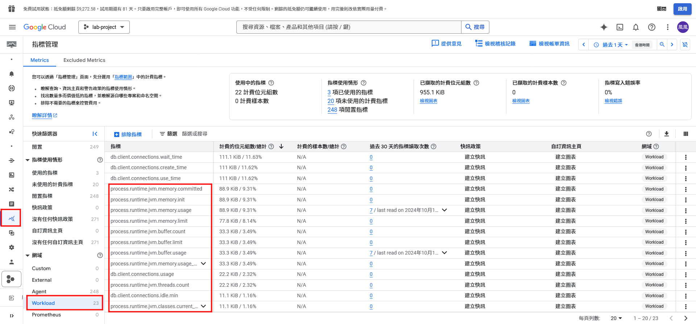
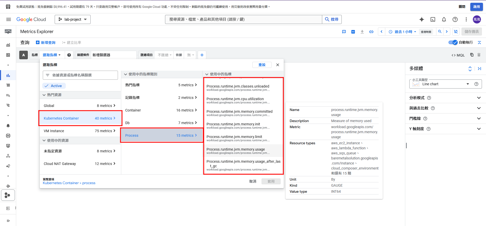
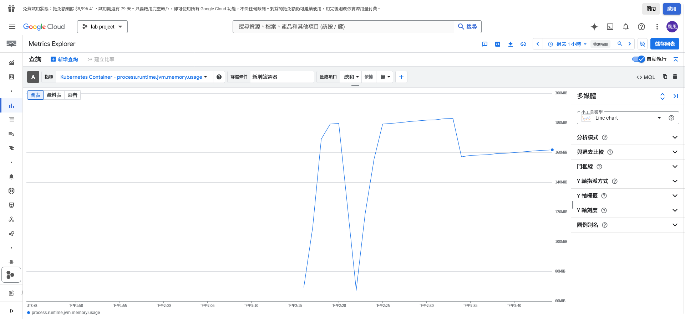

<!-- markdownlint-disable MD028 -->
<!-- markdownlint-disable MD033 -->

# 透過 OpenTelemetry Java Agent 取得 Java Spring Boot 專案中的可觀測性資料

本專案旨在研究如何在 Kubernetes 中透過以DaemonSet的方式OpenTelemetry Collector的方式，將 JVM 相關的可觀測性資料輸出到GCM上。

針對可觀測性的基本知識以及 OpenTelemetry 簡介，可以參閱 `docs` 資料夾下的文件，或點選下方連結:

- [可觀測性簡介](./docs/01-monitoring-basics.md)
- [OpenTelemetry 簡介](./docs/02-opentelemetry-introduction.md)
- [OpenTelemetry SDK Java 實作](./docs/03-java-sdk.md)

本 Lab 部署於 GKE 上。

> 本專案是由 [samuikaze/java-opentelemetry-auto-instrumentation-lab](https://github.com/samuikaze/java-opentelemetry-auto-instrumentation-lab/) 修改而來，移除sql部份，並使用自己的個人帳號進行研究與實作。

## Table of Contents

- [透過 OpenTelemetry Java Agent 取得 Java Spring Boot 專案中的可觀測性資料](#透過-opentelemetry-java-agent-取得-java-spring-boot-專案中的可觀測性資料)
  - [Table of Contents](#table-of-contents)
  - [在 Google Cloud Platform 上實作](#在-google-cloud-platform-上實作)
    - [需求環境](#需求環境)
    - [前置準備](#前置準備)
    - [準備 Docker Image](#準備-docker-image)
    - [準備 OpenTelemetry Java Agent](#準備-opentelemetry-java-agent)
    - [部署 OpenTelemetry Collector](#部署-opentelemetry-collector)
    - [設定 OpenTelemetry Collector](#設定-opentelemetry-collector)
    - [透過 Workload Identity 指定 IAM 角色給 Kubernetes 的 Service Account](#透過-workload-identity-指定-iam-角色給-kubernetes-的-service-account)
    - [部署應用程式](#部署應用程式)
    - [驗證結果](#驗證結果)
  - [參考資料](#參考資料)
    - [主要概念參考資料](#主要概念參考資料)
    - [OpenTelemetry 相關參考資料](#opentelemetry-相關參考資料)
    - [Spring Boot 相關參考資料](#spring-boot-相關參考資料)
    - [GCP 相關參考資料](#gcp-相關參考資料)
    - [其它方案](#其它方案)

## 在 Google Cloud Platform 上實作

本節會說明如何在 GCP 上實作，並將可觀測性資料輸出到 Google Cloud Monitoring (下稱 GCM) 中。

### 需求環境

- Docker 或 Podman (建置 Image 用)
- gcloud 命令列工具
- Helm

### 前置準備

1. Google Kubernetes Engine

    <details>
      <summary>按我展開設定詳細內容</summary>
      <br />
      本 Lab 透過 Google Kubernetes Engine 模擬情境Java Server部署在GKE上，並需要監控的情況，以下為準備GKE的步驟

      - 啟用 Google Kubernetes Engine API
      - 建立叢集，並從畫面右上角選擇建立 Standard 的叢集
      - 依據以下規格建立叢集
        - 基本資訊

          |項目名稱|規格|
          |---|---|
          |名稱|`spring-boot-monitoring-lab`|
          |位置|區域性 / `asia-east1-a`|
          |發佈版本|穩定|

        - 機群註冊

          不勾選

        - 節點集區

          |項目名稱|規格|
          |---|---|
          |集區名稱|`default-pool`|
          |節點數量|1|

          - 節點數

            |項目名稱|規格|
            |---|---|
            |映像檔類型|採用 containerd 的 Container-Optimized OS (cos_containerd) (預設)|
            |機器設定|一般設定 / E2|
            |機器類型|預設 / e2-medium|

          - 節點安全性

            > 依據 [Google 文件](https://cloud.google.com/kubernetes-engine/docs/how-to/hardening-your-cluster?hl=zh-cn#use_least_privilege_sa)的說明，由於 GCE 預設帳戶給予的權限過大，因此較建議自行先建立服務帳號後，再指定必要角色給這個服務帳戶

            > 由於這邊是 Lab 性質專案，因此服務帳戶會直接使用 GCE 預設帳戶

            |項目名稱|規格|
            |---|---|
            |服務帳戶|GCE 預設帳戶|
            |存取權範圍|提供所有 Cloud API 的完整存取權|
            |受防護的選項|勾選啟用完整性監控 / 勾選啟用安全啟動功能 / 不勾選啟用機密 GKE 節點|

        - 網路連線

          |項目名稱|規格|
          |---|---|
          |網路|default / default (10.140.0.0/20)|
          |網路存取權|私人叢集 / 勾選 Access control plane using its external IP address|

        - 安全性

          將以下項目勾選起來

          - 啟用受防護的 GKE 節點
          - 啟用 Workload Identity
          - 安全防護機制 (基本)
          - 工作負載安全漏洞掃描 (基本)

        - 功能

          - 將「啟用 Managed Service for Prometheus」勾選拿掉
    </details>

### 準備 Docker Image

利用本專案的Code建立一個簡單的Java Server，這部分也可以利用其他的Java Server，建立好之後推送到GCP Artifact repository

1. 建立 Docker Image

    ```shell
    cd /path/to/project #專案路徑
    docker build -t asia-east1-docker.pkg.dev/durable-will-453707-f4/image/spring-boot-monitoring-lab:v4 . 
    ```

2. 推送 Docker Image

    ```shell
    docker push asia-east1-docker.pkg.dev/durable-will-453707-f4/image/spring-boot-monitoring-lab:v4
    ```

3. 完成

### 準備 OpenTelemetry Java Agent

1. 參考[官方文檔](https://opentelemetry.io/docs/zero-code/java/agent/getting-started/)的部署步驟，從最新的[release](https://github.com/open-telemetry/opentelemetry-java-instrumentation/releases)取得Java Agent檔案，並將java agent檔案上傳到Google Cloud Storage中:

    ```shell
    gsutil cp [本機檔案路徑] gs://[你的 bucket 名稱]/[目標路徑]
    ```

2. 使用Initial Container的方式，從GCS上拉取檔案，再使用同一個mount volume讓Java server可以使用Agent檔案

   ```yaml
     template:
    metadata:
      labels:
        app: spring-boot-monitoring-lab
    spec:
      serviceAccountName: otel-collector-ksa
      volumes:
        - name: agent-volume
          emptyDir: {}  # 讓 Init Container 和 Java 容器共用

      initContainers:
        - name: init-download-agent
          image: google/cloud-sdk:latest
          command: ["/bin/sh", "-c"]
          args:
            - "gsutil cp gs://otel_bucket/opentelemetry-javaagent.jar /mnt/agent/opentelemetry-javaagent.jar"
          volumeMounts:
            - mountPath: "/mnt/agent"
              name: agent-volume
      containers:
      - name: spring-boot-monitoring-lab
        image: asia-east1-docker.pkg.dev/durable-will-453707-f4/image/spring-boot-monitoring-lab:v4
        volumeMounts:
          - mountPath: "/mnt/agent"
            name: agent-volume
   ```

    ```shell
    kubectl apply -f ./kubernetes-yamls/gke/java-app.yaml
    ```

3. 指定Java啟動參數

   ```yaml
        #Java Agent
    - name: JAVA_TOOL_OPTIONS
      value: "-javaagent:/mnt/agent/opentelemetry-javaagent.jar"
    - name: OTEL_METRIC_EXPORT_INTERVAL
      value: "60000"
    - name: OTEL_EXPORTER_OTLP_ENDPOINT
      value: "http://otel-collector.observability:4317"
    - name: OTEL_EXPORTER_OTLP_METRICS_ENDPOINT
      value: "http://otel-collector.observability:4317"
    - name: OTEL_METRICS_EXPORTER
      value: "otlp"
    - name: OTEL_EXPORTER_OTLP_PROTOCOL
      value: "grpc"
    - name: OTEL_RESOURCE_ATTRIBUTES
      value: "service.name=spring-boot-monitoring-lab,service.version=1.0,gcp.log_name=my-java-log"
    - name: OTEL_TRACES_EXPORTER
      value: "otlp"
    - name: OTEL_LOGS_EXPORTER
      value: "otlp"
    - name: OTEL_JAVAAGENT_DEBUG
      value: "true"
   ```

4. 完成

### 部署 OpenTelemetry Collector

1. 透過以下yaml檔案部署kubernetes-yamls/gke/otel-collector-daemonset.yaml

    ```shell
    kubectl apply -f ./kubernetes-yamls/gke/otel-collector-daemonset.yaml
    ```

2. 完成


### 設定 OpenTelemetry Collector

1. 修改 `./kubernetes-yamls/gke/otel-collector-service.yaml` 檔內容

    ```yaml
    apiVersion: v1
    kind: Service
    metadata:
      name: otel-collector
      namespace: observability  # 請確保你的 otel-collector 也在這個 namespace
      labels:
        app: otel-collector
    spec:
      selector:
        app: otel-collector  # 這要對應 otel-collector Pod 的 label
      ports:
        - name: otlp-grpc
          port: 4317        # 給 OpenTelemetry Protocol (OTLP) gRPC
          targetPort: 4317
          protocol: TCP
        - name: otlp-http
          port: 4318        # 給 OpenTelemetry Protocol (OTLP) HTTP
          targetPort: 4318
          protocol: TCP
        - name: zipkin
          port: 9411        # 給 Zipkin
          targetPort: 9411
          protocol: TCP
        - name: prometheus
          port: 8888        # 給 Prometheus Metrics
          targetPort: 8888
          protocol: TCP
      type: ClusterIP  # 內部 Cluster 內可以存取，外部無法直接訪問

    ```

2. 透過以下指令部署 OpenTelemetry Collector

    ```shell
    kubectl apply -f ./kubernetes-yamls/gke/otel-collector-service.yaml
    ```

3. 完成


### 透過 Workload Identity 指定 IAM 角色給 Kubernetes 的 Service Account

在 GKE 中需透過以下指令將 IAM 指定給 Kubernetes 的 Service Account

> 請將以下變數指定為正確的值:
>
> - `PROJECT_ID`: GCP 專案的 ID
> - `PROJECT_NUMBER`: 在專案概覽中可以看到專案的**號碼**
> - `NAMESPACE`: GKE 中命名空間的名字
> - `KSA_NAME`: 服務帳號名稱

```shell
# Export variables for command
PROJECT_ID=YOUR_PROJECT_ID
PROJECT_NUMBER=YOUR_PROJECT_NUMBER
NAMESPACE=YOUR_NAMESPACE
KSA_NAME=KUBERNETES_SERVICE_ACCOUNT_NAME

# Issue command
gcloud projects add-iam-policy-binding projects/$PROJECT_ID \
    --role=roles/monitoring.metricWriter \
    --member=principal://iam.googleapis.com/projects/$PROJECT_NUMBER/locations/global/workloadIdentityPools/$PROJECT_ID.svc.id.goog/subject/ns/$NAMESPACE/sa/$KSA_NAME \
    --condition=None
```

在這個範例中，OpenTelemetry Collector 所使用的 Kubernetes Service Account 為 `otel-system` 命名空間下的 `gcp-collector`，因此上面的指令可以調整為:

> `PROJECT_ID` 與 `PROJECT_NUMBER` 請自行指定

```shell
# Export variables for command
PROJECT_ID=YOUR_PROJECT_ID
PROJECT_NUMBER=YOUR_PROJECT_NUMBER
NAMESPACE=otel-system
KSA_NAME=gcp-collector

# Issue command
gcloud projects add-iam-policy-binding projects/$PROJECT_ID \
    --role=roles/monitoring.metricWriter \
    --member=principal://iam.googleapis.com/projects/$PROJECT_NUMBER/locations/global/workloadIdentityPools/$PROJECT_ID.svc.id.goog/subject/ns/$NAMESPACE/sa/$KSA_NAME \
    --condition=None
```

由於指令中只能新增一個角色，因此需再透過 Google Cloud Console 將以下的角色加上去

- `roles/monitoring.metricWriter`: 指標資料寫入
- `roles/cloudtrace.agent`: 追蹤資料寫入
- `roles/logging.logWriter`: 日誌資料寫入
- `roles/storage.objectViewer`: 讀取GCS資料

### 部署應用程式

最後將測試的應用程式部署到 GKE 中，透過以下步驟部署應用程式

1. 將應用程式包裝成映像檔

    > 請注意，這邊所使用的映像檔名稱請務必跟 deployment.yaml 中 `image` 欄位的名稱相同

    - 使用 Docker 指令

      ```shell
      # Export variables for command
      IMAGE_REGISTRY_DOMAIN=YOUR_REGISTRY_DOMAIN
      IMAGE_NAME=YOUR_IMAGE_NAME
      IMAGE_VERSION=IMAGE_VERSION

      # Issue command
      docker build -t $IMAGE_REGISTRY_DOMAIN/$IMAGE_NAME:$IMAGE_VERSION
      ```

2. 將映像檔推送到映像檔儲存庫

    - 使用 Docker 指令

      ```shell
      # Export variables for command
      IMAGE_REGISTRY_DOMAIN=YOUR_REGISTRY_DOMAIN
      IMAGE_NAME=YOUR_IMAGE_NAME
      IMAGE_VERSION=IMAGE_VERSION

      # Issue command
      # If you are not using Docker Hub as your image registry
      # You need to use the second command if your registry is not Docker Hub
      docker login
      # docker login $REGISTRY_DOMAIN

      # Push image
      # Add '--tls-verify=false' after the command if TLS certificate is self-signed
      docker push $IMAGE_REGISTRY_DOMAIN/$IMAGE_NAME:$IMAGE_VERSION
      ```


3. 修改部署檔

    - 修改 `./kubernetes-yamls/gke/spring-lab-application-ksa.yaml` 內容，將 Service Account 資訊修改為正確的資訊。
    - 修改 `./kubernetes-yamls/gke/namespace.yaml` 內容，本 Lab 所使用的命名空間為 `observability`
    - 修改 `./kubernetes-yamls/gke/config-map-and-secret.yaml` 內容，將命名空間、名稱、帳號、密碼寫上去


      ```yaml
      # deployment.yaml
      ...
      spec:
        template:
          metadata:
            annotations:
              instrumentation.opentelemetry.io/inject-java: "true"
      ...
      ```

4. 依據下列步驟開始部署
    1. 透過以下指令將命名空間建立起來

        ```shell
        kubectl create namespace observability
        ```

    2. 透過以下指令將 ConfigMap 與 Secrets 部署到 GKE 上

        ```shell
        kubectl apply -f ./kubernetes-yamls/gke/config-map-and-secrets.yaml
        ```

    3. 服務帳號與 IAM 角色

        須建立一支讓 Cloud SQL Auth Proxy 可以進行認證的服務帳號，並指定角色給他

        - 建立服務帳號
          > 此名稱可以更換為任意名稱，但請記得此名稱，後續取得金鑰檔案指令中會用到，範例所使用的服務帳號名稱為 `spring-lab-application-gsa`
        - 指定以下角色給此服務帳號
          - Workload Identity 使用者


    4. 透過以下指令將應用程式與 Service 部署到 GKE 上

        ```shell
        kubectl apply -f ./kubernetes-yamls/gke/java-app.yaml
        ```

### 驗證結果

部署後請依據以下步驟逐步檢查部署是否成功

- 確認應用程式有正常啟動

  應用程式部署後會有兩個執行的容器以及一個初始化的容器，其中初始化的容器只是針對應用程式寫入相關的環境變數，因此其執行過程並不會有任何的日誌被輸出。

  主要要檢查應用程式啟動後有沒有輸出任何錯誤的日誌。

- 檢查 Collector 容器是否有輸出任何錯誤日誌

  應用程式啟動後約過 10 秒就會開始輸出指標，可以觀察在這過程中有沒有輸出類似 `Exporting failed. Dropping data` 字樣的錯誤日誌，正常來說沒有任何錯誤，其日誌會停在啟動成功的字樣。

- 檢查 GCM 上是否有收到指標資料

  打開 GCM，透過**指標管理**頁面左下角的 `Workload` 分類檢查是否有收到 JVM 相關的指標，如下圖所示:

  

  也可以從 GCM 的 Metrics Explorer 中透過以下方式查到相關指標

  

  

以上步驟如果都成功，表示整個部署是成功的。


## 參考資料

### 主要概念參考資料

- [Getting internal JVM metric to GCP Monitoring with OpenTelemetry (and without writing the code)](https://softwaremill.com/getting-internal-jvm-metric-to-gcp-monitoring-with-opentelemetry-and-without-writing-the-code/)
- [OpenTelemetry Operator Complete Guide [OTel Collector + Auto-Instrumentation Demo] - SigNoz](https://signoz.io/blog/opentelemetry-operator-complete-guide/)
- [Easy Telemetry Instrumentation on GKE with the OpenTelemetry Operator - Google Cloud Blog](https://cloud.google.com/blog/topics/developers-practitioners/easy-telemetry-instrumentation-gke-opentelemetry-operator/)
- [在不改動 source code 的情況下，將 Opentelemetry 的 Python auto-instrumentation 加入，導入 trace/log/metrics 監控數據生成](https://sean22492249.medium.com/%E5%9C%A8%E4%B8%8D%E6%94%B9%E5%8B%95-source-code-%E7%9A%84%E6%83%85%E6%B3%81%E4%B8%8B-%E5%B0%87-opentelemetry-%E7%9A%84-python-auto-instrumentation-%E5%8A%A0%E5%85%A5-%E5%B0%8E%E5%85%A5-trace-log-metrics-%E7%9B%A3%E6%8E%A7%E6%95%B8%E6%93%9A%E7%94%9F%E6%88%90-4da76e97862b)
- [Installing with Helm - cert-manager](https://cert-manager.io/docs/installation/helm/)

### OpenTelemetry 相關參考資料

- [Injecting Auto-instrumentation - OpenTelemetry](https://opentelemetry.io/docs/kubernetes/operator/automatic/#java)
- [OpenTelemetry Operator Helm Chart - GitHub](https://github.com/open-telemetry/opentelemetry-helm-charts/blob/main/charts/opentelemetry-operator/README.md#tls-certificate-requirement)
- [Upgrade guidelines - OpenTelemetry Operator Helm Chart - GitHub](https://github.com/open-telemetry/opentelemetry-helm-charts/blob/main/charts/opentelemetry-operator/UPGRADING.md)
- [GoogleCloudPlatform/opentelemetry-operator-sample - GitHub](https://github.com/GoogleCloudPlatform/opentelemetry-operator-sample)
- [Deploying the OpenTelemetry Collector on Kubernetes](https://medium.com/opentelemetry/deploying-the-opentelemetry-collector-on-kubernetes-2256eca569c9)
- [Instrumentation - OpenTelemetry](https://opentelemetry.io/docs/concepts/instrumentation/)
- [Configuration - Collector - OpenTelemetry](https://opentelemetry.io/zh/docs/collector/configuration/#exporters)
- [Injecting Auto-instrumentation - OpenTelemetry](https://opentelemetry.io/docs/kubernetes/operator/automatic/)
- [Opentelemetry collector 在 kubernetes 中的介紹，包含 opentelemetry 的運作基礎 - Medium](https://sean22492249.medium.com/opentelemetry-collector-%E5%9C%A8-kubernetes-%E4%B8%AD%E7%9A%84%E4%BB%8B%E7%B4%B9-%E5%8C%85%E5%90%AB-opentelemetry-%E7%9A%84%E9%81%8B%E4%BD%9C%E5%9F%BA%E7%A4%8E-9b128f9d541b)
- [Using the Collector Builder with Sample Configs on GCP - OpenTelemetry Blog](https://opentelemetry.io/blog/2022/collector-builder-sample/)
- [Google Cloud Exporter - open-telemetry/opentelemetry-collector-contrib - GitHub](https://github.com/open-telemetry/opentelemetry-collector-contrib/tree/main/exporter/googlecloudexporter)
- [Prometheus Exporter - open-telemetry/opentelemetry-collector-contrib - GitHub](https://github.com/open-telemetry/opentelemetry-collector-contrib/blob/main/exporter/prometheusexporter/README.md)

### Spring Boot 相關參考資料

- [Spring Boot with Docker](https://spring.io/guides/gs/spring-boot-docker)
- [maven - Official Image - Docker Hub](https://hub.docker.com/_/maven)
- [tomcat - Official Image - Docker Hub](https://hub.docker.com/_/tomcat)
- [eclipse-temurin - Official Image - Docker Hub](https://hub.docker.com/_/eclipse-temurin)
- [OpenTelemetry Java - MVN Repository](https://mvnrepository.com/artifact/io.opentelemetry/opentelemetry-sdk)
- [Deploying Spring Boot War in Tomcat running in Docker - Medium](https://iamvickyav.medium.com/deploying-spring-boot-war-in-tomcat-based-docker-2b689b206496)
- [Deploying Spring boot War Application on Docker - Medium](https://medium.com/%E7%A8%8B%E5%BC%8F%E8%A3%A1%E6%9C%89%E8%9F%B2/deploying-spring-boot-war-application-on-docker-6c696626ef00)
- [Deploying JavaWeb Application on Docker Tomcat Service - Medium](https://medium.com/%E7%A8%8B%E5%BC%8F%E8%A3%A1%E6%9C%89%E8%9F%B2/deploying-javaweb-application-on-docker-tomcat-service-e5c576c02819)
- [Deploying Spring boot War Application on Docker - Medium](https://medium.com/%E7%A8%8B%E5%BC%8F%E8%A3%A1%E6%9C%89%E8%9F%B2/deploying-spring-boot-war-application-on-docker-6c696626ef00)
- [Deploy a Spring Boot application in docker - Medium](https://medium.com/@thexpertdev/deploy-a-spring-boot-application-in-docker-7309de435ef6)
- [9 Tips for Containerizing Your Spring Boot Code - Docker](https://www.docker.com/blog/9-tips-for-containerizing-your-spring-boot-code/)
- [Getting '404' while running java war file with docker image - Stack Overflow](https://stackoverflow.com/a/78005948)
- [Using Docker from Maven and Maven from Docker - Medium](https://medium.com/containers-101/using-docker-from-maven-and-maven-from-docker-1494238f1cf6)
- [Using a ConfigMap PropertySource - Spring Docs](https://docs.spring.io/spring-cloud-kubernetes/reference/property-source-config/configmap-propertysource.html)
- [How to link SpringBoot application.properties file to Kubernetes ConfigMaps and Secrets - Stack Overflow](https://stackoverflow.com/a/75926201)
- [Spring Boot Kubernetes - Spring Docs](https://spring.io/guides/gs/spring-boot-kubernetes)
- [Failed to register 'filter errorPageFilterRegistration' on the servlet context - Stack Overflow](https://stackoverflow.com/a/77043086)
- [Having an issue deploying my war file to tomcat 9 - r/SpringBoot - reddit](https://www.reddit.com/r/SpringBoot/comments/1edmcvm/having_an_issue_deploying_my_war_file_to_tomcat_9/)
- [After deployment of WAR to tomcat docker container always getting 404 - Stack Overflow](https://stackoverflow.com/a/40715033)

### GCP 相關參考資料

- [Access non-gcr public container registry from private GKE cluster - Stack Overflow](https://stackoverflow.com/a/57664750)
- [預先定義角色 - 使用 IAM 控制存取權 - Google Cloud Observability 文件](https://cloud.google.com/monitoring/access-control?hl=zh-cn#predefined_roles)
- [從 GKE 工作負載向 Google Cloud API 進行身份驗證](https://cloud.google.com/kubernetes-engine/docs/how-to/workload-identity?hl=zh-cn#gcloud_1)
- [[GKE] Workload Identity 試用小記 - Shao-Heng Tai](https://danielsig727.tw/posts/201907/190720_gke_workload_identity/)
- [從 Google Kubernetes Engine 連線到 Cloud SQL - Google Cloud SQL 文件](https://cloud.google.com/sql/docs/mysql/connect-kubernetes-engine?hl=zh-cn)
- [使用 Cloud SQL Auth 代理連線 - Google Cloud SQL 文件](https://cloud.google.com/sql/docs/mysql/connect-auth-proxy?hl=zh-cn#private-ip)
- [使用最小權限 IAM 服務帳號 - 強化叢集的安全性 - Google Kubernetes Engine (GKE) 文件](https://cloud.google.com/kubernetes-engine/docs/how-to/hardening-your-cluster?hl=zh-cn#use_least_privilege_sa)
- [--verbosity - gcloud - Cloud SDK 文件](https://cloud.google.com/sdk/gcloud/reference#--verbosity)
- [Issue #1853 Connecting to cloud sql instance using workload identity federation credential config file - GoogleCloudPlatform/cloud-sql-proxy - GitHub](https://github.com/GoogleCloudPlatform/cloud-sql-proxy/issues/1853)
- [Issue #66020 Container-level usage of field "serviceAccountName" - kubernetes/kubernetes - GitHub](https://github.com/kubernetes/kubernetes/issues/66020)

### 其它方案

- [Kube eagle - GitHub](https://github.com/cloudworkz/kube-eagle)
- [Prometheus Java Agent as sidecar - GitHub](https://github.com/flokkr/jmxpromo-sidecar)
- [JMX Exporter - GitHub](https://github.com/prometheus/jmx_exporter)
- [獨立的 JVM 監控外掛 - Google Cloud Observability 文件](https://cloud.google.com/monitoring/agent/plugins/jvm?hl=zh-cn)
- [Ops Agents - GitHub](https://github.com/GoogleCloudPlatform/ops-agent)
- [OpenTelemetry 收集器使用入門 - Google Cloud Observability 文件](https://cloud.google.com/stackdriver/docs/managed-prometheus/setup-otel?hl=zh-cn)
