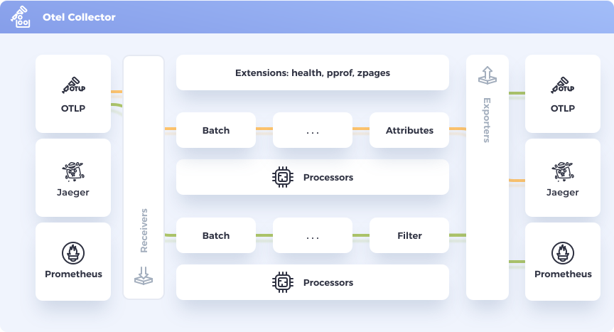
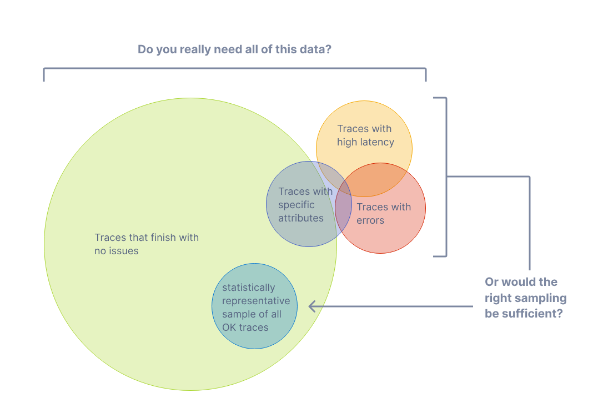

# OpenTelemetry 簡介

本章會簡介何謂 OpenTelemetry、概念、元件以及其規範。

## Table of Contents

- [何謂 OpenTelemetry](#何謂-opentelemetry)
- [Instrumentation](#instrumentation)
  - [Zero-Code Solutions](#zero-code-solutions)
  - [Code-Based Solutions](#code-based-solutions)
- [OpenTelemetry 元件](#opentelemetry-元件)
  - [規範](#規範)
  - [Collector](#collector)
  - [特定語言的 API 與 SDK 實作](#特定語言的-api-與-sdk-實作)
  - [Kubernetes Operator](#kubernetes-operator)
  - [FaaS Assets](#faas-assets)
- [參考資料](#參考資料)

## 何謂 OpenTelemetry

> OpenTelemetry 是一個可觀測性框架和工具包， 旨在建立和管理遙測資料，如追蹤、指標和日誌。重要的是，OpenTelemetry 與供應商和工具是無關的，這意味著它可以與各種可觀測性後端一起使用， 包括 Jaeger 和 Prometheus 這類開源工具以及商業化產品。
>
> OpenTelemetry 不是像 Jaeger、Prometheus 或其他商業供應商那樣的可觀測性後端。 OpenTelemetry 專注於遙測資料的產生、收集、管理和匯出。 OpenTelemetry 的主要目標是：無論應用程式或系統採用何種程式語言、基礎設施或執行階段環境，你都可以輕鬆地將其儀表化。而遙測資料的儲存與可視化是有意留給其他工具處理的。
>
> 節錄自[官方文件](https://opentelemetry.io/zh/docs/what-is-opentelemetry/)於ˊ2024-11-12 時的說明

從官方的說明文字可以知道 OpenTelemetry 是一個可觀測性的框架，由於可觀測性的規格一直沒有一套統一的規範，因此在實作上都是視採用的可觀測性後端去決定要使用哪家的規則去建立與收集資料，當需轉換可觀測性後端到另外一套系統時，就必須耗費相當多的時間去調整與修改這些設定。

OpenTelemetry 是由 OpenTracing 與 OpenCensus 兩個專案合併而成，原本這兩個專案都是為了解決「缺乏統一標準的方法來為程式碼進行儀表化 (Instrument) 並將遙測資料 (Telemetry) 傳送到可觀測性後端」問題而建立的。由於這兩個專案都無法獨立解決這個問題，所以將其合併成立了 OpenTelemetry， 吸收了兩邊的優勢，提供了統一的解決方案。

OpenTelemetry 提供了一套收集、處理與匯出遙測資料的標準，搭配 OpenTelemetry 官方與第三方套件的實作，就可以輕鬆讓多種可觀測性後端看懂應用程式輸出的遙測資料，而不需要透過人工修改方式。

## Instrumentation

為了使系統可以被觀測，該系統必須被儀表化，言下之意就是該系統的元件必須輸出 Logs、Metrics 與 Traces，透過 OpenTelemetry 有 Zero-Code Solutions 與 Code-Based Solutions 兩種方式可以將系統儀表化。

### Zero-Code Solutions

此方案適用於無法修改程式碼的情境，其透過多個套件實作提供一系列豐富的遙測資料，讓這些無法修改程式碼的應用程式也可以像自行開發的應用程式般取得相關的遙測資料。

使用此方式的缺點是當所需的遙測資料過於客製化時，就無法達成目的。

### Code-Based Solutions

此方案適用於非無法修改程式碼的所有情境，是自訂性最高的方式，透過 OpenTelemetry 提供的特定語言 SDK 或 API 將指定的遙測資料輸出。

使用此方案的缺點是需要手動設定 SDK 與 API 的行為，對於 SDK 或 API 的使用必須有一定的知識量。

## OpenTelemetry 元件

OpenTelemetry 由以下元件所構成，下面會個別針對其元件進行說明。

- 規範
- Collector
- 特定語言的 API 與 SDK 實作
- Kubernetes Operator
- FaaS 資產

### 規範

OpenTelemetry 規範說明了針對所有跨語言實作的要求與期望。其除了定義相關術語之外，也定義了以下項目:

- API

  定義用於產生、關聯 Traces、Metrics 與 Logs 資料的類型與操作。

- SDK

  定義特定語言實作 API 的要求。組態、資料處理與匯出也在此定義。

- 資料

  定義 OpenTelemetry Protocol (OTLP) 與可供可觀測性後端支援、不偏頗於任何供應商的語意約定。

### Collector

OpenTelemetry Collector 是與供應商無關的代理程式，可以接收、處理和匯出遙測資料。其支援多種格式的遙測資料
，可於匯出遙測資料到可觀測性後端前先針對資料進行處理或過濾，並可將這些遙測資料轉送到一個或多個可觀測性後端。

OpenTelemetry Collector 要達到的目的有以下幾項:

- 可用性 (Usability)

  合理的預設設定、支援常用通訊協定、不須特別進行設定就可以開始執行與收集遙測資料

- 效能 (Performance)

  在不同的組態與環境下，都可以保持高度的穩定性與效能

- 可觀測性 (Observability)

  Collector 本身也會輸出遙測資料

- 可擴充性 (Extensibility)

  客製化 Collector 不須修改其核心程式碼

- 統一性 (Unification)

  撰寫相同格式與風格的程式碼就可以在不同的應用程式與可觀測性後端間收集、處理與匯出遙測資料

### 特定語言的 API 與 SDK 實作

OpenTelemetry 也提供了特定語言的 SDK 讓開發者可以透過 OpenTelemetry API 產生遙測資料，並將這些遙測資料匯出到任意支援的可觀測性後端中。

這些 SDK 也可讓開發者引入 Instrumentation 函式庫到常用的框架或函式庫中，並透過其手動監測應用程式。

- Instrumentation 函式庫

  OpenTelemetry 支援豐富的元件，這些元件會從支援語言熱門函式庫與框架產生相關的遙測資料。其期望這些熱門的函式庫或框架將可觀測性實作為預設功能，而不須再依賴任何第三方套件或函式庫。

- 匯出器 (Exporters)

  將遙測資料送到 OpenTelemetry Collector 可以確保這些資料被正確的匯出，在正式環境中使用 OpenTelemetry Collector 來收集遙測資料是最佳實踐做法，經過處理後再將這些遙測資料透過 Exporter 匯出到可觀測性後端。

  目前官方與第三方支援的可觀測性後端匯出器可以參考[這份官方清單](https://opentelemetry.io/ecosystem/registry/?component=exporter&language=)

  OpenTelemetry Protocol (OTLP) Exporter 是以 OpenTelemetry 模型設計的，因此可在不遺失任何資訊的情況下匯出 OTel 格式的遙測資料，目前許多可觀測性後端皆支援 OTLP 遙測資料，因此遷移可觀測性後端不再需要繁複的作業就可完成。

- Zero-Code 監測

  若選擇的語言支援的話，OpenTelemetry 提供一種不需修改程式碼就可對應用程式進行監測的方案，這種方案非常適用於無法修改程式碼的情境。

  OpenTelemetry 會透過在應用程式中加入監測的函式庫和 Exporter 來監測應用程式。

- 資源偵測器 (Resource detectors)

  資源以其屬性表示產生遙測資料的實體。例如：在 Kubernetes 容器中執行會產生遙測資料的應用程式其包含有 Pod 名稱、命名空間等資訊，你可以用這些屬性來當作過濾條件。

  OpenTelemetry 的特定語言實作從 `OTEL_RESOURCE_ATTRIBUTES` 環境變數提供資源偵測，常見的實體 (例: 程序執行階段、服務、主機或作業系統) 可以透過該環境變數來偵測或過濾指定的資源。

- 跨資源傳播器 (Cross-service propagators)

  傳播是在服務或應用程式間移動資料的機制，雖然不限於追蹤 (Trace)，但其允許追蹤 (Trace) 在任意分佈於程序或網路邊界的服務間建立系統的關聯資訊。在大多數情形下，上下文傳播 (Context Propagation) 發生於監測函式庫 (Instrumentaion Libraries)。

- 採樣器 (Samplers)

  採樣是限制系統產生追蹤 (Trace) 數量的程序。OpenTelemetry 針對每種程式語言都提供數種標頭採樣器 (Head Sampler)。

  更多關於 Sampling 的說明請參閱[官方文件](https://opentelemetry.io/docs/concepts/sampling/)

  

### Kubernetes Operator

OpenTelemetry Operator 是 Kubernetes Operator 的實作。人員可透過 OpenTelemetry 管理 OpenTelemetry Collector 與工作負載的 Auto-Instrumentation。

Operator 可以注入並組態 OpenTelemetry Auto-Instrumentation 函式庫，目前 OpenTelemetry Auto-Instrumentation 支援以下幾種語言與應用程式

- Apache HTTPD
- .Net
- Go
- Java
- Nginx
- NodeJS
- Python

### FaaS Assets

OpenTelemetry 支援多種由不同雲服務商提供的 Function-as-a-Service 的監控方法。

OpenTelemetry 社群目前提供預建的 Lambda 層，可自動對應用程式進行監測 (Auto-Instrument)，並可透過獨立 Collector Lambda 層手動或自動對應用程式進行監測。

## 參考資料

- [文件 | OpenTelemetry](https://opentelemetry.io/zh/docs/)
- [OpenTelemetry auto-instrumentation injection - open-telemetry/opentelemetry-operator - GitHub](https://github.com/open-telemetry/opentelemetry-operator#opentelemetry-auto-instrumentation-injection)
